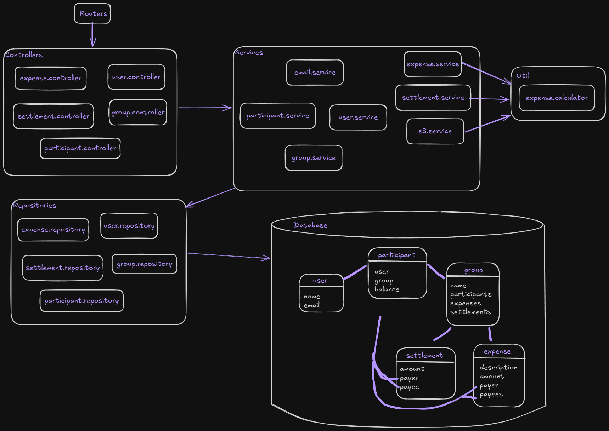

# Payment Splitter 

## Overview

Welcome to my first experience with Node.js and TypeScript.
\
This is an API that manages expenses within a group of users.
\
Users can create groups, add expenses, track balances, and record settlements.

## Design Decisions

*   **Technology Stack:** Node.js with Express.js, Typescript, Tsyringe for dependency injection, TypeORM for data mapping, Jest for testing.
*   **Database:** PostgreSQL.
*   **Architecture:** Concerns are separated into service, repository, and controller. See diagram below for more information.


\
\
HTTP requests are made to the server. Routers sends them to controllers. Controllers handle HTTP requests and responses. Services handle business logic. Repositories interface with the database.
\
About the data model:
- **Users**: contain personal information.
- **Participant**: is the combination of a Group with a User. This means that a User can be in multiple groups, but it's balance is tracked by the Participant entity. 
- **Group**: contains the participants and all the expenses and settlements.
- **Expense**: has an amount, one payer and multiple payees, which are Participants.
- **Settlement**: contains an amount, one payer and one payee, which are Participants.  

## Assumptions and Limitations (also a future-works list)

* Authentication is out of scope for now, so is authorization and other security checks.
* There is no validation of incoming requests.
    * The requests' bodies are assumed to be complete and containing all the information necessary.
* Error handling is very limited and can be improved with more responses and logging.
* Test classes can be improved.
    * Integration tests are also needed.
* Currently only equal splitting of expenses is provided.
* The API is not optimized for extremely high loads and might require performance tuning for large-scale deployments.
    * Caching with Redis can be added to avoid some database calls. Getting group participants and their expenses, for example.
    * No rate-limiters are set.
    * S3 service can be a bottleneck if the CSV file is too big.
    * Sending emails can also be a bottleneck, and could be done asynchronously.
* There's no CI/CD pipeline.
    * Could use GitHub actions to test automatically and deploy to AWS. 

## Getting Started

[**Provide simple instructions on how to run the API locally.**  This should be straightforward for someone to quickly set up and test your API. Examples:]

1.  **Prerequisites:**
    *   Node.js (I have v20.15.0 )
    *   npm (I have v10.7.0)
    *   A PostgreSQL instance
    *   An AWS account with an S3 bucket
    *   A Gmail account
2.  **Installation:**
    ```bash
    git clone git@github.com:vmrfreitas/payment-splitter.git
    cd payment-splitter
    npm install
    ```
3.  **Configuration:**
    *   Create a `.env` file in the root directory and configure the following environment variables:
        ```
        AWS_ACCESS_KEY_ID=your_access_key_id
        AWS_SECRET_ACCESS_KEY=your_secret_access_key
        AWS_REGION=yout_aws_region
        S3_BUCKET_NAME=your_bucket_name
        EMAIL_PASSWORD=123456
        DB_HOST=localhost
        DB_PORT=5432
        DB_USERNAME=your_username
        DB_PASSWORD=your_password
        DB_DATABASE=postgres
        ```
    *   To get the AWS access key id and secret, it is recommended that you create a new user on the IAM service. [Here](https://docs.aws.amazon.com/IAM/latest/UserGuide/access-keys-admin-managed.html) you can see more information about it.
    *   After creating the S3 bucket, you need to give permission to access it to your new user. [Here](https://docs.aws.amazon.com/AmazonS3/latest/userguide/access-policy-language-overview.html?icmpid=docs_amazons3_console) you can read more about it.
    *   To use Gmail you will need to create an application specific password, a normal password will not work. [Here](https://www.nodemailer.com/usage/using-gmail/) is more information about it.
4.  **Running the API:**
    ```bash
    npm run start:dev
    ```
5.  **Accessing the API:**
    *   The API will be running at `http://localhost:3000` (or the port you configured).

## API Endpoints

[**List the available endpoints with a brief description of each.**  Focus on clarity and conciseness.  A table format can be very effective.  For each endpoint, include:]

*   **Endpoint:** (e.g., `POST /groups`)
*   **Method:** (e.g., `POST`, `GET`, `PUT`, `DELETE`)
*   **Description:** (e.g., "Creates a new group.")
*   **Request Body (if applicable):** (Briefly describe the expected request body format and important fields. You can link to a more detailed schema if needed, but for a simple README, concise is better.)
*   **Response Body (if applicable):** (Briefly describe the response body and important fields.  Again, keep it concise.)

**Example Endpoint Table:**

Swapped some of the information for `...` for the sake of brevity.

| Endpoint          | Method | Description                     | Request Body (Example)                               | Response Body (Example)                                  |
| :---------------- | :----- | :------------------------------ | :----------------------------------------------------- | :----------------------------------------------------------- |
| `/groups`         | POST   | Create a new group. UserIds can be empty. | `{ "name": "My Group", "userIds": ["id1", "id2"] }` | `{ "message": "Group created successfully", "group": { "name": "My Group",...}}` |
| `/groups`         | GET   | Get all groups | None | `[ { "createdAt": "...", "updatedAt": "...", "id": "...", "name": "My Group", "participants": [ { "userId": "...", "groupId": "...", "balance": "0.00" } ] } ]` |
| `/groups/{groupId}` | GET    | Get group by ID | None | `{ "createdAt": "...", "updatedAt": "...", "id": "...", "name": "My Group", "participants": [ { "userId": "...", "groupId": "...", "balance": "0.00" } ] }` |
| `/groups/{groupId}` | PATCH    | Update group name | `{ "name": "New name" }` | `{ "message": "Group name changed successfully", "group": {...` |
| `/groups/{groupId}` | DELETE | Delete group | None | `{ "message": "Group deleted successfully" }` |
| `/groups/{groupId}/transactions` | GET | Get a complete transaction history for the group | None | `[ { "id": "..", "type": "expense", "payer": "Name", "payees": [ "Name2", "Name3" ], "amount": "500.00", "description": "...", "createdAt": "..." } ]` |
| `/users`         | POST   | Create a new user | `{ "name": "Alfred", "email": "alfred@gmail.com" }` | `{ "message": "User created successfully", "user": { "name": "..", "email": "..", "createdAt": "..", "updatedAt": "..", "id": ".." } }` |
| `/users`         | GET   | Get all users | None | `[ { "createdAt": "...", "updatedAt": "...", "id": "...", "email": "alfred@gmail.com", "name": "Alfred" } ]` |
| `/users/{userId}` | GET | Get user by ID | None | `{ "createdAt": "...", "updatedAt": "...", "id": "...", "email": "...", "name": "...", "participants": [ { "userId": "...", "groupId": "...", "balance": "0.00" } ] }` |
| `/users/{userId}` | DELETE | Delete user | None | `{ "message": "User deleted successfully" }` |
| `/groups/{groupId}/participants` | POST   | Add participants to a group | `{ "userIds" : ["id1","id2"] }` | `{ "message": "Participants added successfully", "participants": [ { "user": { ... }, "group": { ... }, "balance": 0 } ] } `  |
| `/groups/{groupId}/participants` | GET    | Get participants of a group | None | `[ { "userId": "...", "groupId": "...", "balance": "0.00" } ]` |
| `/groups/{groupId}/participants/{userId}` | DELETE | Remove participant from a group | None | ``{ "message": "Participant removed successfully" }`` |
| `/groups/{groupId}/expenses` | POST | Add expense to a group | `{ "description": "Pizza", "amount": "100", "payerId": "id", "payeeIds": ["id2", "id3"] }` | `{ "message": "Expense added successfully", "expense": { "description": "..", "amount": 100, "payer": { "userId": "id", "groupId": "...", "balance": 66.66 }, "payees": [ { "userId": "id2", ... } ... ] } } `  |
| `/groups/{groupId}/expenses/import` | POST | Import expenses from S3 bucket | `{ "key": "path-to-file.csv" }` | `{ "message": "Expenses imported successfully", "expenses": [ { "description": "...", ... } ] }` |
| `/groups/{groupId}/expenses` | GET    | Get expenses from a group | None | `[ { "createdAt": "...", "updatedAt": "...", "id": "...", "description": "Pizza", "amount": "100.00" } ]` |
| `/groups/{groupId}/expenses/{expenseId}` | DELETE | Remove expense from a group | None | ``{ "message": "Expense removed successfully" }`` |
| `/groups/{groupId}/settlements` | POST | Add settlement to a group | `{ "amount": "100", "payerId": "id", "payeeId": "id2" }` | `{"message": "Settlement added successfully", "settlements": { "amount": 100.00, "payer": { "userId": "id", "groupId": "...", "balance": 0 }, "payee": { "userId": ... } } }`  |
| `/groups/{groupId}/settlements/{settlementId}` | DELETE | Remove settlement from a group | None | ``{ "message": "Settlement removed successfully" }`` |

[**Add more endpoints following the same format.** Cover the main functionalities of your API.]

## Hoppscotch/Postman Collection

The collection was created using [Hoppscotch](https://hoppscotch.io/), but you can also import on Postman by following [these steps](https://learning.postman.com/docs/getting-started/importing-and-exporting/importing-from-hoppscotch/).
\
[Download Collection](./api-hoppscotch-collection.json)